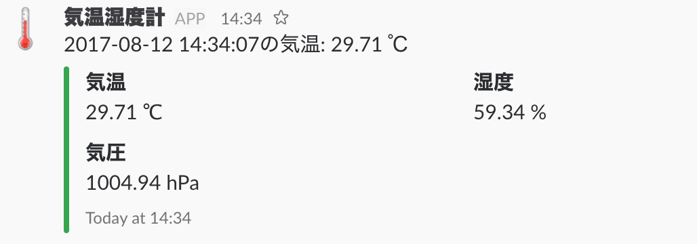

# ruby-bme280-to-slack

環境センサーBME280から値を取得してslackに通知するスクリプト.

## `lib/pri` 以下のライブラリについて

Javier Valencia氏が下記フォーラムにて公開されたものです。
https://www.raspberrypi.org/forums/viewtopic.php?f=34&t=157278
BSDライセンスによるとの氏の投稿がありましたので、無保証であることと各ライブラリの著作権については Javier Valencia氏に属することをここに明記しておきます。

## 事前準備

1. slack にサインアップ
2. Integrations で Incoming WebHocks を設定して WebhockURL をメモっておきます。
3. gem をインストールします
```
$ gem install slack-notifier --no-ri --no-rdoc
```

## 設定
```
$ vi post_to_slack.rb
```
`WEBHOCKURL` に slack の IncommingWebHock の WebhockURL を設定してください。
`CHANNEL` にメッセージ送信先の channel を設定してください。デフォルトでは `#general` になっています。


## 実行
```
$ ruby post_to_slack.rb
```
slack に通知されるか確認してください。

